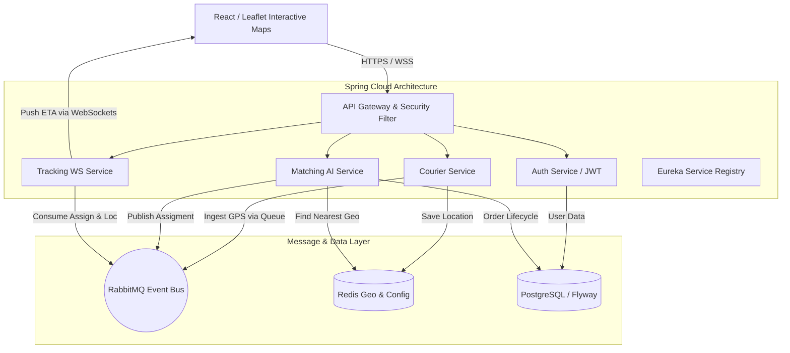

# Fleet Flow: Real-Time Fleet Management & Delivery Intelligence


Fleet Flow is an **enterprise-grade, event-driven microservices architecture** designed to simulate the massive scale and complex algorithmic challenges handled by delivery giants like *DoorDash*, *UberEats*, and *Getir*. 

It is capable of handling **high-frequency GPS telemetry ingestion**, performing **geospatial heuristic assigning**, and broadcasting **real-time WebSockets tracking** to thousands of clients simultaneously.

---

## Key Features & Engineering Highlights

### 1. High-Frequency GPS Ingestion
Instead of overwhelmingly thrashing a relational database, the system ingests thousands of courier GPS coordinates per second into **Redis GeoHash**. High-throughput GPS updates are fire-and-forgotten into **RabbitMQ**, acting as an event bus to asynchronously decouple load from the REST controllers.

### 2. Neighborhood Pooling (Geospatial AI Scoring)
A customized VRP (Vehicle Routing Problem) heuristic engine. When a new order arrives, the `MatchingService` doesn't just look for "idle" couriers. It queries Redis for a 5KM radius and executes a **Heuristic Scoring Algorithm**:
- **Capacity Constraint:** Couriers can carry max 3 active orders simultaneously.
- **Route Affinity Bonus:** If an already moving courier has an order heading to a destination `< 2km` away from the *new* order's destination, the system applies a massive negative bonus (`-10.0`) to their score, dynamically "Pooling" the deliveries into a single optimized route to slash operational costs.

### 3. Weather-Aware Dynamic Routing
Fleet Flow integrates with the **Open-Meteo REST API** to fetch real-time weather conditions acting upon the pickup coordinates.
- **Dynamic Speed (ETA):** The `TrackingService` dynamically slows down the courier's simulated speed mathematically during `RAIN` (-25%), `SNOW` (-50%), or `STORM` calculations.
- **Capacity Throttling:** The AI assignment engine dynamically drops the maximum courier pooling capacity from `3` to `1` during severe weather.

### 4. Enterprise Zero-Trust Security
The API Gateway acts as an iron-clad fortress against cyber threats:
- **HttpOnly, SameSite=Strict Cookies:** JWT tokens are never exposed to the frontend's JavaScript scope, ensuring 100% immunity against XSS token harvesting.
- **Reactive Redis Rate Limiting:** Enforces strict burst capacities (`HTTP 429 Too Many Requests`) via IP tracking to thwart DDoS and Brute-Force attacks.
- **Helmet Security Headers:** `Content-Security-Policy`, `X-Frame-Options (DENY)`, and `X-Content-Type-Options` are injected natively in Spring WebFlux.

### 5. Distributed Tracing & Resilience
- **Zipkin & Micrometer:** Every HTTP request and RabbitMQ message is injected with a Trace ID (B3 Propagation), allowing deep visibility into microservice latency graphs.
- **Resilience4j Circuit Breakers:** Fallback methods are cleanly executed if the Redis Geo clusters or PostgreSQL instances fail, preventing cascading cluster failures across the services.

---

## System Architecture



---

## Tech Stack
* **Java 21 & Spring Boot 3.2.x** (WebFlux, Data JPA, Cloud Gateway, Netflix Eureka)
* **Frontend:** React 18, Vite, Framer Motion, Leaflet.js
* **Messaging:** RabbitMQ (AMQP)
* **Caching & Geo:** Redis (GeoRadius, StringRedisTemplate)
* **Database:** PostgreSQL (with Flyway Migrations)
* **DevOps:** Docker Compose, GitHub Actions (CI/CD)
* **Testing:** k6 (Load Testing)

---

## How to Run Locally

### Prerequisites
- Docker & Docker Compose
- JDK 21
- Node.js 18+
- Maven

### Steps

1. **Spin up the Infrastructure (RabbitMQ, Redis, Postgres, Zipkin):**
   ```bash
   docker compose up -d
   ```

2. **Run all Microservices (PowerShell):**
   The project includes a multi-threaded boot script that automatically compiles the shared `common-lib` and concurrently boots all 5 Spring Boot properties.
   ```powershell
   .\scripts\start-all.ps1
   ```
   *(Alternatively, run `mvn spring-boot:run` in all module directories: `eureka-server`, `api-gateway`, `auth-service`, `courier-service`, `matching-service`, `tracking-service`.)*

3. **Start the React Frontend:**
   ```bash
   cd fleet-flow-ui
   npm install
   npm run dev
   ```

4. **Access the Application:**
   Open `http://localhost:5173` in your browser. All API requests are proxied via Spring Cloud Gateway (`http://localhost:8080`).

---

## Load Testing
Included within the repository is an enterprise load testing script (`scripts/load-test.js`) built with **k6**. It simulates thousands of concurrent virtual users (VUs) continuously broadcasting GPS coordinates to test the system's threshold.

```bash
k6 run scripts/load-test.js
```

