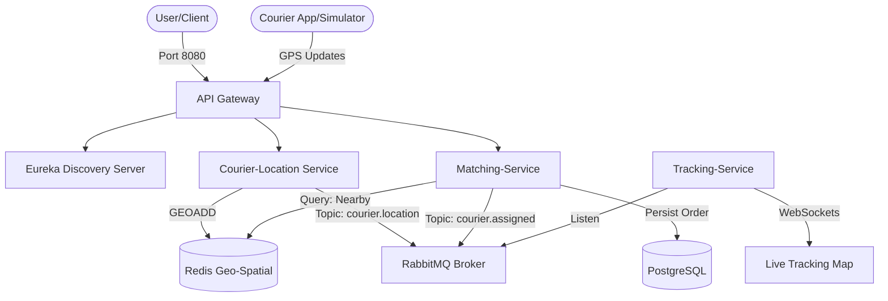

# Fleet Flow | Real-Time Fleet Management System


**Fleet Flow** is a high-performance, real-time logistics and courier tracking system. Designed to simulate the architecture used by giants like Uber, DoorDash, and Getir, it handles high-frequency GPS data streams and provides real-time matching between customers and couriers.

## Architecture Ovenview



## Key Features

- **High-Frequency Ingestion**: Built to handle 1000+ couriers sending GPS data every 3 seconds.
- **Geospatial Processing**: Uses Redis `GEOADD` and `GEORADIUS` for sub-millisecond proximity searches.
- **Event-Driven Microservices**: Async communication via RabbitMQ ensure low latency and high scalability.
- **Real-Time Visualization**: React dashboard with Leaflet.js map, updating courier positions via WebSockets (STOMP).
- **Service Discovery**: Netflix Eureka manages microservice lifecycle and registration.

## Tech Stack

- **Backend**: Java 21, Spring Boot 3, Spring Cloud Gateway, Eureka.
- **Messaging**: RabbitMQ.
- **Databases**: Redis (Geospatial), PostgreSQL.
- **Frontend**: React, Vite, Leaflet.js, Framer Motion, Lucide.
- **DevOps**: Docker & Docker Compose.

## How to Run

### 1. Infrastructure
Spin up the standard required infrastructure:
```bash
docker-compose up -d
```

### 2. Microservices
Run each Spring Boot service (Discovery, Gateway, Courier, Matching, Tracking).
```bash
mvn clean install
# Then run main classes
```

### 3. Frontend
```bash
cd fleet-flow-ui
npm install
npm run dev
```

### 4. Simulation
Run the courier simulator to see the map in action:
```bash
python scripts/simulate_couriers.py
```

## Performance & Scalability
- **Latency**: Matching engine returns nearby couriers in <100ms.
- **Resilience**: RabbitMQ decouples ingestion from business logic.
- **UX**: Premium dark-mode dashboard with smooth animations.
