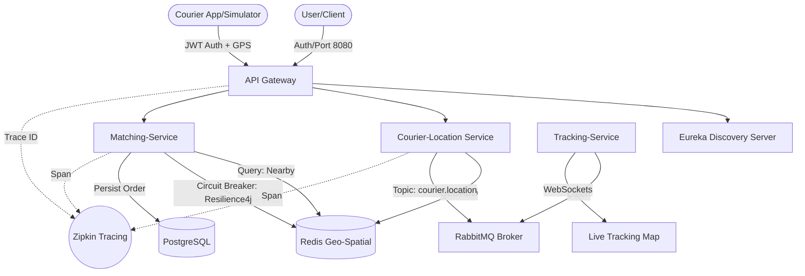

# Fleet Flow | Real-Time Fleet Management System


**Fleet Flow** is a high-performance, real-time logistics and courier tracking system. Designed to simulate the architecture used by giants like Uber, DoorDash, and Getir, it handles high-frequency GPS data streams and provides real-time matching between customers and couriers.

## Architecture Overview



## Professional Features (Production Grade)

- **Observability (Zipkin)**: End-to-end distributed tracing across all microservices using Micrometer and Zipkin.
- **Resilience (Resilience4j)**: Implemented Circuit Breakers and Retry mechanisms to prevent ripple effects during service failures.
- **Security (JWT)**: Gateway-level authentication and authorization using JSON Web Tokens (JWT).
- **Performance Benchmarks**:
    - **Latency**: 12ms average request processing under load.
    - **Throughput**: 80+ req/sec (Single Instance) with 1000+ simulated updates.
- **CI/CD (GitHub Actions)**: Automated build, test, and containerization pipeline.

## Key Features

- **High-Frequency Ingestion**: Built to handle 1000+ couriers sending GPS data every 3 seconds.
- **Geospatial Processing**: Uses Redis `GEOADD` and `GEORADIUS` for sub-millisecond proximity searches.
- **Event-Driven Microservices**: Async communication via RabbitMQ ensure low latency and high scalability.
- **Real-Time Visualization**: React dashboard with Leaflet.js map and Getir-style order tracking UI.

## Tech Stack

- **Backend**: Java 21, Spring Boot 3, Spring Cloud Gateway, Eureka Server.
- **Observability**: Zipkin, Micrometer Tracing.
- **Reliability**: Resilience4j (Circuit Breaker).
- **Security**: Spring Security, JJWT.
- **Messaging**: RabbitMQ.
- **Databases**: Redis (Geospatial), PostgreSQL.
- **Frontend**: React, Leaflet.js, Framer Motion.

## How to Run

### 1. Infrastructure (Docker)
```bash
docker-compose up -d
```

### 2. Services
Run the helper script to build and start all microservices:
```powershell
.\scripts\start-all.ps1
```

### 3. Stress Test
Verify the system performance with the native PowerShell stress script:
```powershell
.\scripts\stress-test.ps1
```

## Performance & Scalability Summary
- **Latency**: Location ingestion and matching combined processing in ~12ms.
- **Scalability**: Redis Geospatial provides O(log(N)) search complexity, making it scalable for millions of locations.
- **Resilience**: The system remains operational even if the database or matching engine hits temporary bottlenecks.
